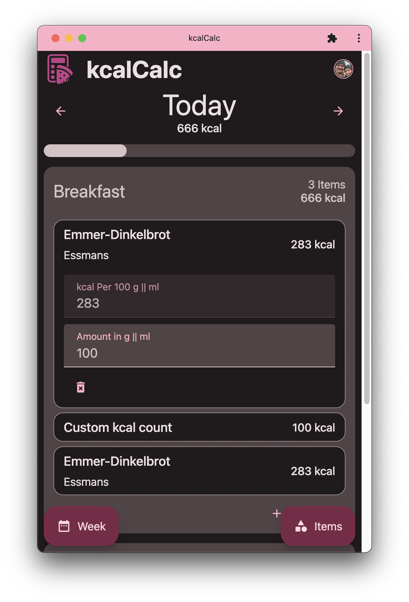
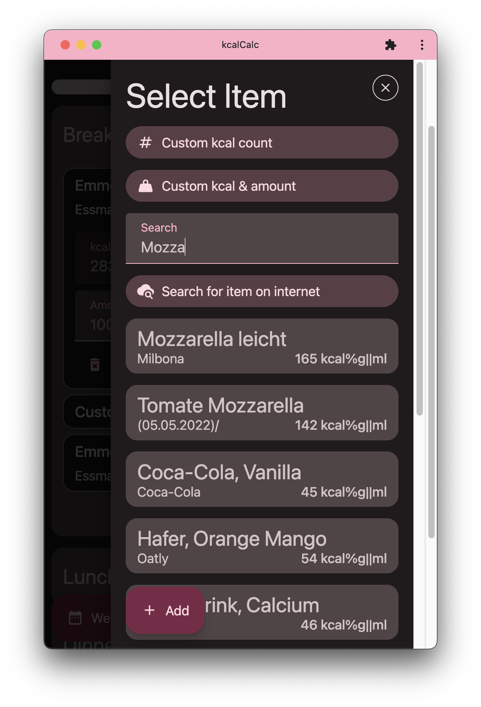
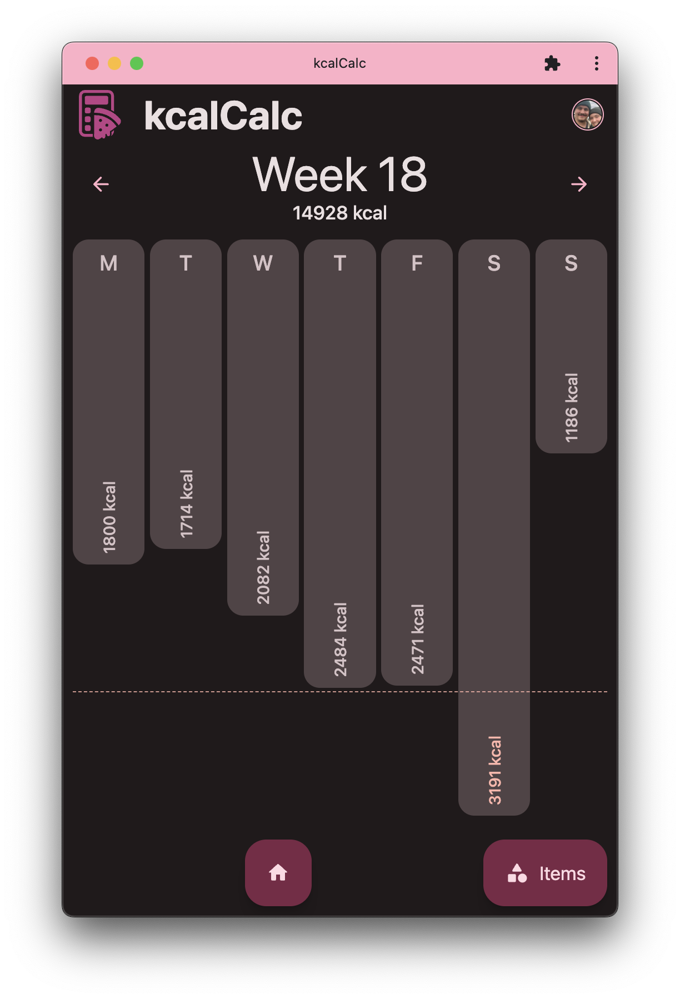
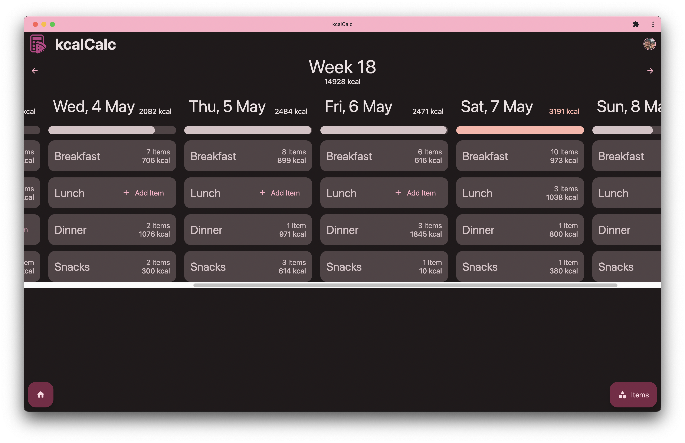

# kcalCalc

A free calorie counting app made to fit my needs.

Give it a shot at [kcal-calc.vercel.app](https://kcal-calc.vercel.app)

| Mobile Day View                       | Item Selection                                          | Mobile Week View                          |
| ------------------------------------- | ------------------------------------------------------- | ----------------------------------------- |
|  |  |  |

| Desktop Unified View                           |
| ---------------------------------------------- |
|  |

## Self Hosting

kcalCalc can be self-hosted for yourself for free using Firebase and a Cloud Host like Vercel.

### Setup Firebase

- Create new Firebase Project
- Create Web App
- Copy following env values for later:
  - VITE_APIKEY
  - VITE_AUTHDOMAIN
  - VITE_PROJECTID
  - VITE_STORAGEBUCKET
  - VITE_MESSAGINGSENDERID
  - VITE_APPID
- Enable Auth: Go to "Authentication" > "Get started" > "Google" > "Enable" > set "Project support email" field > "Save"
- Enable Firestore: Go to "Firestore Database" > "Create database" > "Start in test mode" > "Next" > set "Cloud Firestore location" field near you > "Enable"
- Setup Rules: "Firestore Database" > "Rules" > paste following
  - ```js
    rules_version = '2';
    service cloud.firestore {
      match /databases/{database}/documents {
          match /Users/{userId}/{documents=**} {
          allow read, write: if userId == request.auth.uid;
        }
      }
    }
    ```

### Host frontend

- You can use a service like Vercel to host the frontend.
- Fork the repo and login to Vercel via GitHub
- Create a new project using the forked repo and add the env variables from above

## Development

- Copy env variables in a `.env` file
- `pnpm i`
- `pnpm dev`
